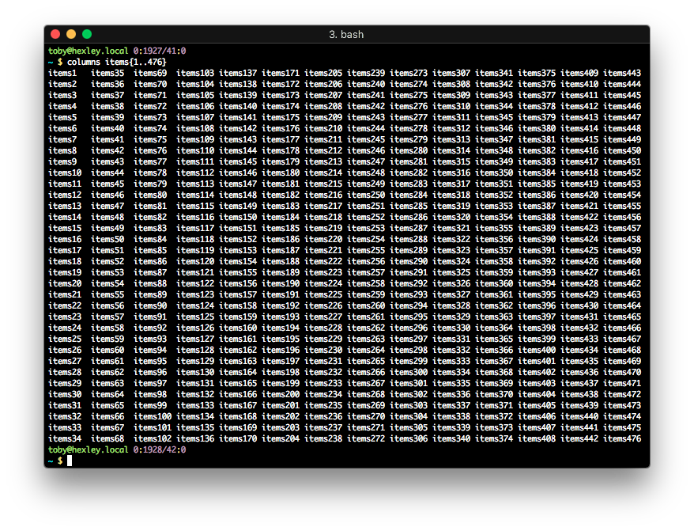

# PRINT A LIST IN COLUMNS

*Does what it says on the tin.*



Print a list in columns based on the size of the current terminal, favoring
vertical space over horizontal, i.e) use all available vertical space before
creating additional columns.

## INSTALLATION

`pip install columns`

## CLI USAGE

```
usage: columns [-h] list [list ...]

Print a list in columns.

positional arguments:
  list        A list to print.

optional arguments:
  -h, --help  show this help message and exit
```

## EXAMPLES

`columns items{0..256}`

`columns $(shuf -n 100 /usr/share/dict/words)`
