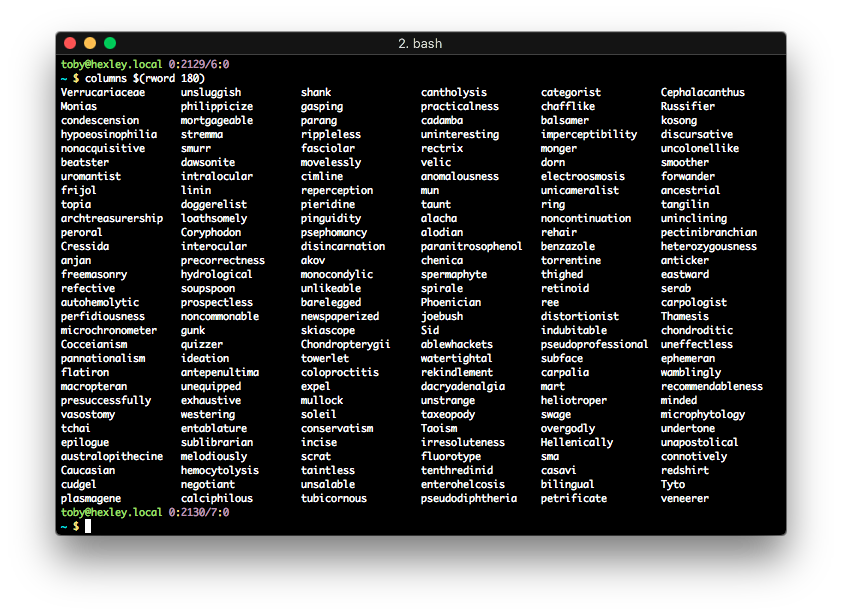

# PRINT A LIST IN COLUMNS

*Dynamically transform long lists into columns appropriate for terminal
dimensions.*



Print a list in columns based on the size of the current terminal. Use all
available vertical space before creating additional columns. Once all horizontal
space has been populated with columns, add additional rows.

## INSTALLATION

`pip install columns`

## CLI USAGE

```
usage: columns [-h] list [list ...]

Print a list in columns.

positional arguments:
  list        A list to print.

optional arguments:
  -h, --help  show this help message and exit
```

## PYTHON USAGE

```python
from columns import prtcols

my_list = amazing_generator_function()
vertical_padding_space = 10

prtcols(my_list, vertical_padding_space)
```

## EXAMPLES

`columns items{0..256}`

`columns $(shuf -n 100 /usr/share/dict/words)`
