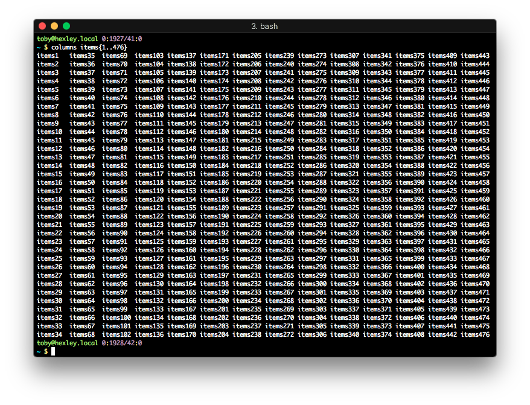

# PRINT A LIST IN COLUMNS

*Does what it says on the tin.*



## INSTALLATION

`pip install columns`

## CLI USAGE

```
usage: columns [-h] list [list ...]

Print a list in columns.

positional arguments:
  list        A list to print.

optional arguments:
  -h, --help  show this help message and exit
```
